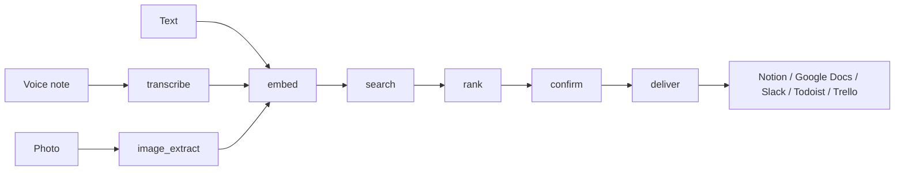

# NoteRoute

Capture a thought by voice, text or photo and NoteRoute files it in the right place for you. It reads the note, works out which of your connected workspaces it belongs in (Notion, Google Docs, Slack, Todoist or Trello), asks you to confirm, and delivers it.

I built and run NoteRoute on my own, from the LangGraph pipeline to the web and mobile clients. This repo holds the AI pipeline and the web app. The FastAPI backend lives in [NoteRoute-Backend](https://github.com/JaegerDanger2022/NoteRoute-Backend).

## How it works



The graph picks its entry point from the input type, so audio goes through transcription, photos go through text extraction, and plain text skips straight to embedding. Every step can short-circuit to the end on an error, so a bad file never reaches a user's workspace. State is checkpointed in Postgres, so the pipeline can wait for the user's confirm before it delivers anything.

## What's inside

| Folder | What it is |
| --- | --- |
| `NoteRoute-LangGraph` | FastAPI service that runs the LangGraph pipeline. Deployed on Railway with Docker. |
| `NoteRoute-NextJS` | Next.js web client: record, history, destination slots, sources, OAuth callbacks. |

## Stack

- **Pipeline:** LangGraph, LangChain, Claude on AWS Bedrock (Sonnet to summarize, Haiku to score), Whisper on Groq with an AWS Transcribe fallback
- **Retrieval:** Pinecone, dual-vector retrieval with score fusion
- **State:** LangGraph Postgres checkpointer, MongoDB (Motor and Beanie) for app data
- **Web:** Next.js, TypeScript, Tailwind, Radix UI, Zustand, Tiptap editor, Firebase auth
- **Mobile:** Expo React Native client on the same backend
- **Delivery:** SSE streaming, direct-to-S3 uploads, five OAuth integrations behind one add-an-integration pattern
- **Images:** HEIC and HEIF photos converted to JPEG before extraction

## Running the pipeline locally

```bash
cd NoteRoute-LangGraph
pip install -r requirements.txt
# set AWS, Pinecone, Postgres and MongoDB settings in .env
uvicorn app.main:app --reload
```

## Author

Martin Mensah-Solomon, Applied AI Engineer. [Portfolio](https://martins-portfolio.click) and [LinkedIn](https://www.linkedin.com/in/mkmensahsol).
